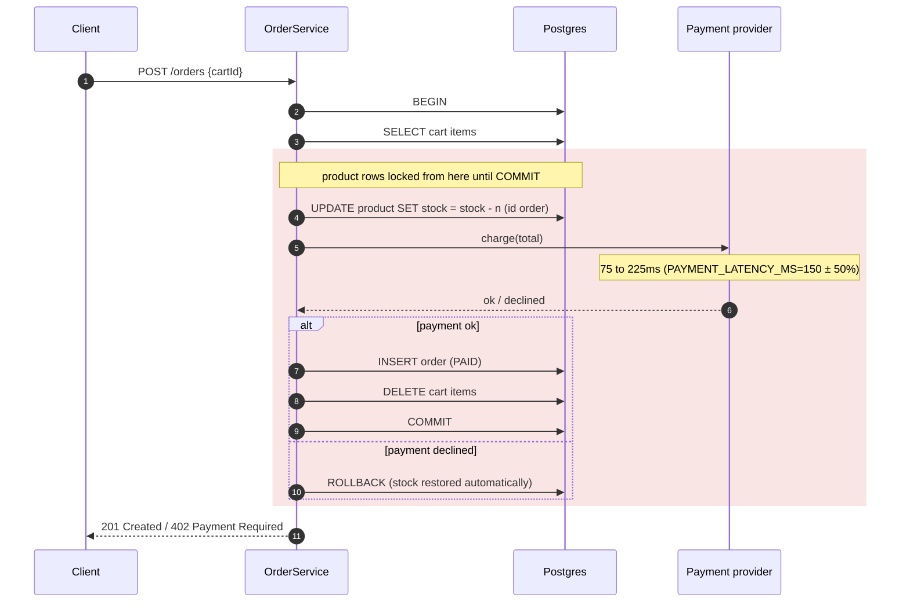
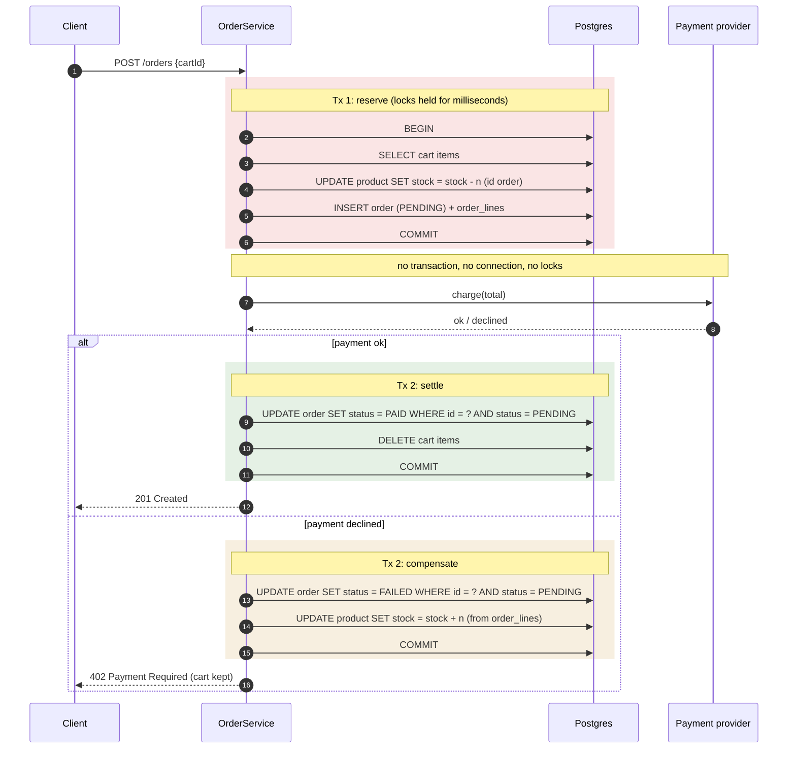
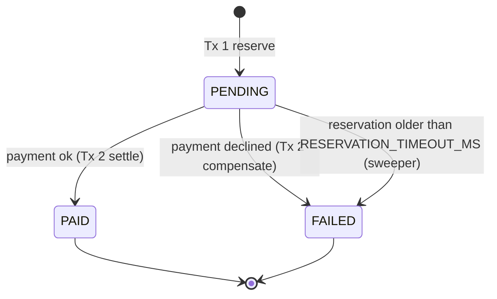
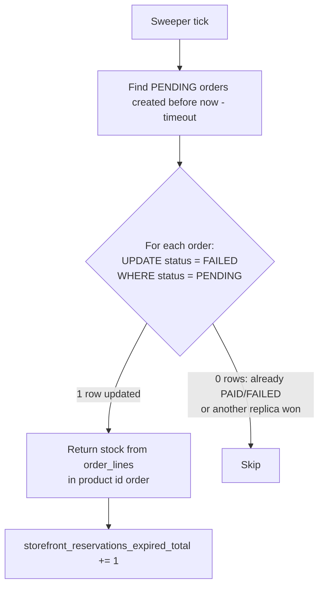

# Checkout architecture: single-tx vs. saga

Status: **saga is the default** since 2026-10-01 (commit `6dfb0d8`). `single-tx` is kept for comparison.
Selected with `CHECKOUT_MODE` (`storefront.checkout-mode`); see [OrderService.java](../../app/src/main/java/com/example/storefront/order/OrderService.java).

## Summary

Checkout has to do three things: take stock, charge the customer, and record the order. The two designs
differ only in **how long the database holds a lock on the product rows**.

| | `single-tx` | `saga` (default) |
|---|---|---|
| Transactions per checkout | 1 | 2 (3 if payment fails) |
| Row locks held during payment | **Yes** | No |
| DB connection held during payment | Yes | No |
| Undo on payment failure | Automatic rollback | Explicit compensating step |
| Order states | `PAID` only | `PENDING` → `PAID` or `FAILED` |
| Extra moving parts | None | `order_lines` table, expired-reservation sweeper |
| p99 checkout latency, 30 VUs | 0.78s | 0.25s |

Both return the same HTTP results (`201`, `402`, `409`, `400`) and pass the same integration tests.

## Why the lock matters

`take stock` is `UPDATE product SET stock = stock - n WHERE id = ? AND stock >= n`. Postgres keeps the
row lock from that update **until the transaction commits**. Any other checkout that touches the same
product blocks on its own `UPDATE` until then. The catalog has only 8 products, so most carts overlap.

## single-tx



Simple and atomic: on any exception the transaction rolls back and nothing needs undoing. The cost
is that the lock and the pooled connection are held for the whole payment call.

## saga



## Two checkouts of the same product

Checkout A starts at 0ms and checkout B at 10ms, with a 150ms payment. In `single-tx`, B's
`UPDATE` blocks until A commits. In `saga`, B waits only for A's few-millisecond reserve step.

```mermaid
gantt
    dateFormat x
    axisFormat %Lms
    title Same product, two concurrent checkouts (150ms payment)

    section single-tx A
    Hold lock (reserve, charge, commit) :crit, 0, 160
    section single-tx B
    Blocked on A's row lock              :active, 10, 160
    Hold lock (reserve, charge, commit) :crit, 160, 320
    section saga A
    Reserve (lock)  :crit, 0, 5
    Charge          :5, 155
    Settle          :155, 160
    section saga B
    Reserve (lock)  :crit, 10, 15
    Charge          :15, 165
    Settle          :165, 170
```



In `single-tx` each extra overlapping checkout adds another full payment to the wait. That's why the tail
(p99, max) grows much faster than the median as load rises.

## Order lifecycle (saga)



`single-tx` writes orders directly as `PAID`. A declined payment leaves no order row because the whole
transaction rolls back. Orders created before 2026-10-01 have a null status.

## Crash recovery (saga only)

If a pod dies between Tx 1 and Tx 2, the order stays `PENDING` and its stock stays reserved.
`releaseExpiredReservations()` runs every `RESERVATION_SWEEP_INTERVAL_MS` (30s) on every replica and
releases reservations older than `RESERVATION_TIMEOUT_MS` (2 min).



## Invariants

1. **Each order is settled once.** Every transition out of `PENDING` is the conditional update
   `settle(id, to)` ([OrderRepository.java](../../app/src/main/java/com/example/storefront/order/OrderRepository.java)),
   which matches only `status = PENDING`. Whichever of payment success, payment failure, or the sweeper
   gets there first wins. The others update 0 rows and stop, so stock is never returned twice.
2. **Rows are locked in product id order** in both reserve and release (`takeStock`, `release`), so two
   carts with the same products in a different order cannot deadlock.
3. **Stock is only returned for reservations that were actually released** (the `settle` update
   returned 1).
4. **Metrics are recorded after the outcome is final.** `storefront_checkouts_total{status}` is incremented in
   [OrderController.java](../../app/src/main/java/com/example/storefront/order/OrderController.java)
   after the service returns or throws.

## Failure modes

| Scenario | single-tx | saga |
|---|---|---|
| Payment declined | Rolled back; 402 | Compensated; order `FAILED`; 402 |
| Pod dies mid-payment, charge didn't happen | Rolled back by Postgres | `PENDING` until the sweeper releases it (≤ timeout + sweep interval) |
| Pod dies after a successful charge, before commit/settle | **Customer charged, no order record** | Customer charged, order `PENDING` → `FAILED` by the sweeper. The record exists, so it can be refunded or reconciled. |
| Payment succeeds after the sweeper released the reservation | n/a | Settle updates 0 rows → `ReservationExpiredException` → 500, logged as needing a refund |
| Slow payment provider | Locks and connections held longer; other checkouts queue | Only that request is slower |

Single-tx's "atomic" design doesn't cover the payment provider: a charge can't be rolled back. Saga at
least leaves a durable record to reconcile against.

## Measurements

2026-10-01, Docker Compose on a laptop, 150ms payment latency, 2% payment failure rate, `checkout-stress` k6 profile
(the only profile at the time), measured after a 30s warm-up.

| 30 k6 VUs, 2 min | single-tx | saga |
|---|---|---|
| p50 | 0.197s | 0.157s |
| p95 | 0.523s | 0.236s |
| p99 | 0.781s | 0.246s |
| max | 1.999s | 0.425s |
| under 0.5s | 95.6% | 100% |
| Hikari pending (max) | 0 | 0 |

At 5 VUs the two are indistinguishable (p95 ≈ 0.25 to 0.31s), because there's too little overlap to contend.
The test `SagaCheckoutIntegrationTest.concurrentCheckoutsOfTheSameProductDoNotQueueBehindPayment`
captures the difference deterministically: 8 concurrent same-product checkouts at 400ms payment latency
finish in < 1.3s with saga, and take about 3.4s with single-tx.

To reproduce:

```bash
CHECKOUT_MODE=single-tx docker compose up -d storefront-api
docker compose --profile load run --rm --no-deps -e PROFILE=checkout-stress -e DURATION=30s k6          # warm-up
docker compose --profile load run --rm --no-deps -e PROFILE=checkout-stress -e DURATION=2m -e VUS=30 k6
# then repeat with CHECKOUT_MODE=saga
```

`--no-deps` matters: without it, `compose run` recreates the API container with the default mode.

## Configuration

| Env var | Property | Default | Meaning |
|---|---|---|---|
| `CHECKOUT_MODE` | `storefront.checkout-mode` | `saga` | `saga` or `single-tx`; anything else fails startup |
| `RESERVATION_TIMEOUT_MS` | `storefront.reservation-timeout-ms` | `120000` | Age at which a `PENDING` reservation is released |
| `RESERVATION_SWEEP_INTERVAL_MS` | `storefront.reservation-sweep-interval-ms` | `30000` | How often the sweeper runs |

## Known gaps

- **No idempotency key.** The fake provider ignores retries. A real integration would pass the order id
  so a retried charge can't bill twice.
- **No reconciliation with the provider.** The sweeper assumes an unfinished checkout wasn't charged.
  A real system would ask the provider before releasing, and refund `ReservationExpiredException` cases.
- **No payment timeout.** A hung provider call holds a request thread indefinitely (Roadmap Phase 5: Resilience4j).
- **Concurrent checkouts of the same cart** reserve stock twice and create two orders. This happens in both
  modes. A unique constraint or a cart-level lock would fix it.
- **Cart edited between reserve and settle.** Settle deletes the whole cart, including items added after
  the reservation.
- **Schema is managed by `ddl-auto: update`.** The `status` column and `order_lines` table were added that way.
  Roadmap Phase 2 moves to Flyway.
